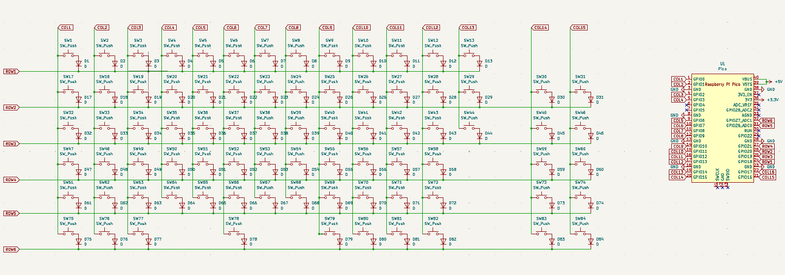
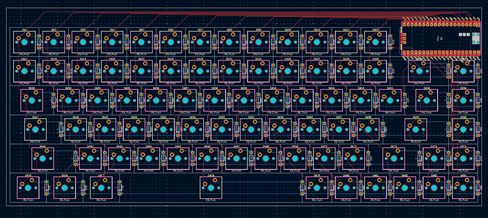
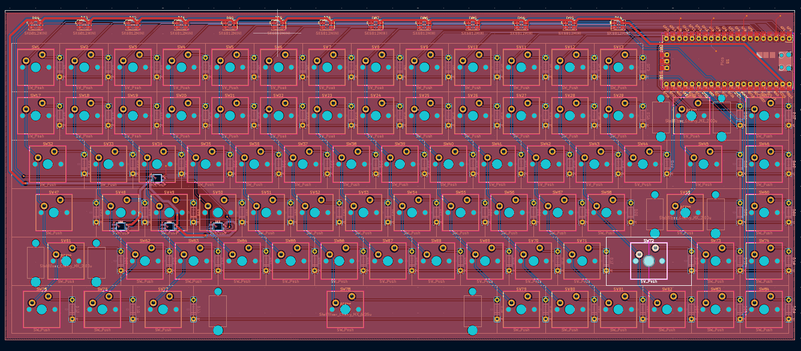
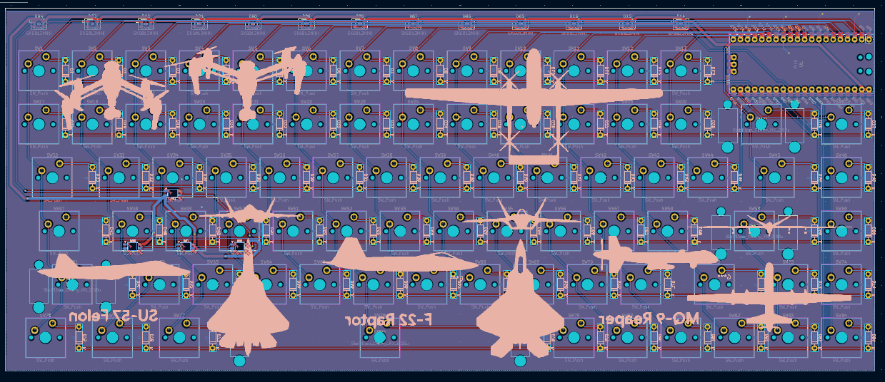

# Journal for CrystalBoard

- Date 26/07/25
    - Idea: Make a custom mechanical keyboard with case made up of clear acrylic sheets stacked on top of each other, thus the name crystal board!
    - Work done - Finalised the layout, took it from keyboard-layout-editor.com and drawn all the rows and columns on that layout!
    
    - Setup Kicad with all the libraries and footprints.
    - Time Spent - 30 mins
    
- Date 27/07/25
    - I made the complete schematic made the PCB layout but then I noticed that there is no space for Pi Pico. So I deleted the top right 3 keys, thus I had to do changes in the Kicad Schematic and PCB. Thus took some time but I am done with PCB routing. Now I am thinking to add some neopixels and some silkscreen to the PCB.
    - The updated keyboard layout looks like this now:
    
    - Kicad Schematic and PCB:
    
    
    - Things to do next - Put some Neopixels, Stabilizers, Plate, Silkscreen
    - Time Spent today till now - 3 hours

- Date 27/07/25 (Update 2)
    - Done with the Neopixels, I did not add per key LED but a bar on top and on WASD keys (not for gaming obviously :O)
    
    - Time Spent - 1.5 hours

- Date 28/07/25 
    - Done with Silkscreen and Stablizers.
    - It was pain to convert the images into B&W vectors.
    - PCB Looks like this now:
    
    - Time spent - 1.5 hours

- Date 31/07/25
    - Speedrunning the Case and Code File!
    - Case I have designed as layers since I will be laser cutting the acrylic sheets.
    - For illustration purposes I have just reduced the opacity of the components in Autocad to make it look like Acrylic, but in real life it will look really good!
    
    - Time spent - 3 hours

    - Finalized the repo and collected resources for all the BOM.
    - Time Spent - 2 hours!